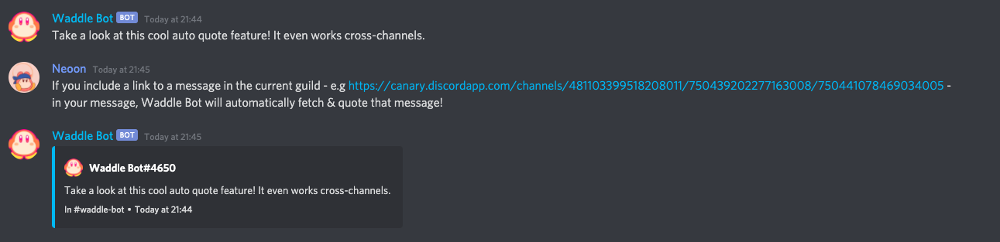

## Note

This code base is kind of messy and not really the greatest at the moment. Once Discord.js v13 releases on stable, I'm planning on completely rewriting this bot in TypeScript and implementing the new Discord features like slash commands, buttons, and maybe select menus and threads once those get public.

# Waddle Bot

The cutest and bestest Discord Bot! (My mom said so at least)

## About

This is a discord.js bot I'm doing for fun in my free time. If you want to invite the bot, [click here](https://discord.com/oauth2/authorize?client_id=723224456671002674&scope=bot&permissions=8 'Waddle Bot Invite').  
The current global prefix is **`w?`**, however once I get a database, this prefix will be able to be configured per guild.  
Run `w?help` for an overview of all commands.
(Currently not really working on the bot.)

---

## Features

Waddle Bot has a lot of commands for Utility and Fun, while providing a few simple tools for managing & moderating your servers!

### Autoquote

This is a simple utility feature I hope a lot of people will find useful, the screenshot should explain what it does. Note that this will not work with message links from another guild.

### Commands

1. Fun!

    - Text Manipulation
    - Image Manipulation
    - Facts and Jokes via APIs
    - Random
    - Gifs
    - Social

1. Utility

    - Information about Users, Servers, Roles, Channels, Emotes and Colors
    - Polls
    - Evaluating math expressions

1. Server Management & Moderation

    - Adding and Editing Roles
    - Setting custom Slowmode
    - Basic Moderation tools for (Soft-)Banning, Kicking, Purging and Setting Nicknames

---

## Upcoming Features

I am not really working on this bot much as of this moment, but I do plan on getting a database for it sometime in the feature. A database would allow features like:

-   Guild Configurations (Custom prefixes, Welcome/Leave Messages, Modetator Roles)
-   An experience system
-   A moderation system for logging infractions/warnings
-   Other small cool stuff like reminders

I will also be looking into getting a hosting provider for the bot to be online 24/7. However, as this still is only a fun project, I'm not sure if I want to spend money on it for now.

---

## Credits

If you want you can find me on Discord (Neoon#5790) or [Twitter](https://twitter.com/BaumianerNiklas 'BaumianerNiklas on Twitter').

Thanks to all my friends for giving me ideas for the bot and generally being awesome :)

All emotes used in the bot are from [emoji.gg](https://emoji.gg).
